## Domain Controller Setup
Documentation of my hands-on practice configuring a Windows Server 2022 virtual machine as an Active Directory Domain Controller. 

### Task
Configure the Windows Server with a static IPv4 address and configure it to provide DNS services for the isolated lab network.

### Why
The Domain Controller requires predictable network configuration, and the client needs to reliably locate the server/DNS service.

### What I did
Configured the server's IPv4 address, subnet mask, and DNS settings.

### Verification
Tested connectivity and DNS resolution from both the client and server.

### Evidence
`02-server-ipv4.png` - Server IPv4 and DNS configuration.
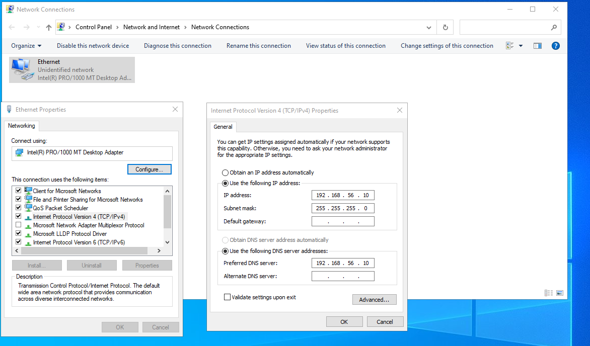

## Domain Controller Discovery

### Task
Verify that the Windows 11 client can locate the Active Directory Domain Controller through the configured domain.

### Why
Active Directory clients need to locate a Domain Controller to authenticate and access domain services.

### What I did
Used `nltest /dsgetdc:LAB.local` from the Windows 11 client to query the domain and locate the Domain Controller.

### Verification
The command returned `DC01.LAB.local` at `192.168.56.10` and identified it as a Domain Controller for `LAB.local`.

### Evidence
`03-domain-controller-discovery.png` - Successful Domain Controller discovery from the Windows 11 client.
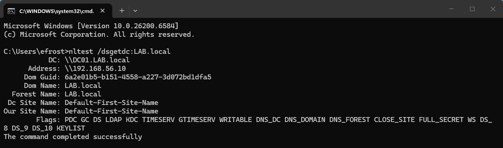

## Active Directory Domain Controller

### Task
Verify that the Windows Server is configured as a Domain Controller for the `LAB.local` Active Directory domain.

### Why
The Domain Controller provides centralized Active Directory services for the lab environment, including authentication and directory management.

### What I did
Verified the Domain Controller configuration using Active Directory Users and Computers.

### Verification
The `Domain Controllers` container in `LAB.local` displayed `DC01`, confirming that the server is registered as a Domain Controller in the domain.

### Evidence
`04-active-directory-domain-controller.png` - Active Directory Users and Computers showing `DC01` in the `Domain Controllers` container.
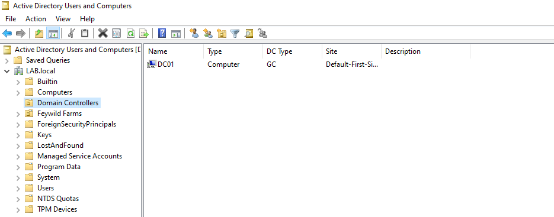

## Windows Client Domain Join

### Task
Join the Windows 11 client to the `LAB.local` Active Directory domain.

### Why
Joining the client to the domain allows it to participate in the Active Directory environment and use centralized domain authentication and management.

### What I did
Configured the Windows 11 client to join the `LAB.local` domain.

### Verification
The System Properties window shows the computer name as `ST01.LAB.local` and the domain as `LAB.local`.

### Evidence
`05-windows-client-domain-join.png` - Windows 11 System Properties showing `ST01.LAB.local` joined to the `LAB.local` domain.
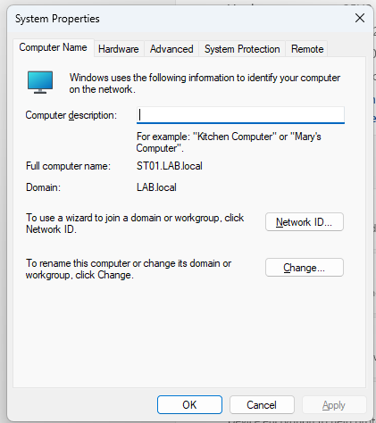

## Organizational Unit Structure

### Task
Organize the `LAB.local` Active Directory environment using Organizational Units (OUs) based on the structure of the lab organization.

### Why
Organizational Units provide a way to organize users and groups within Active Directory and can be used to apply department-specific configurations and permissions.

### What I did
Created a `Feywild Farms` OU under `LAB.local`, with separate `Accounts` and `Groups` OUs. Under `Accounts`, created department-specific OUs for Finance, HR, IT, and Sales.

### Verification
Verified the OU hierarchy using Active Directory Users and Computers.

### Evidence
`06-active-directory-ou-structure.png` - Active Directory Users and Computers showing the `Feywild Farms` OU structure and department OUs.

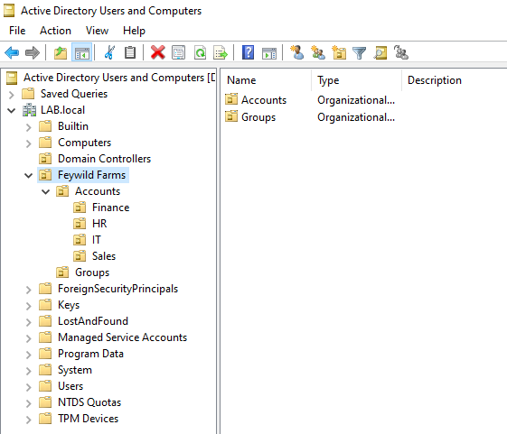

## Active Directory Security Groups

### Task
Create department-specific security groups within the `Feywild Farms` Active Directory structure.

### Why
Security groups can be used to manage access to shared resources and permissions based on department membership.

### What I did
Created Finance, HR, IT, and Sales security groups within the `Groups` OU.

### Verification
Verified the department groups using Active Directory Users and Computers.

### Evidence
`07-active-directory-groups-structure.png` - Active Directory Users and Computers showing the department security groups.
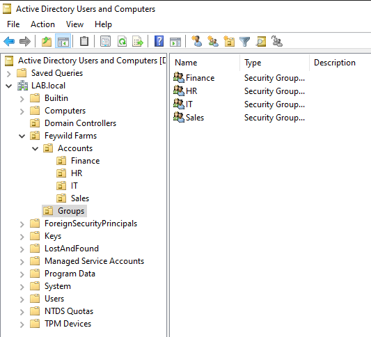

## User Account Configuration

### Task
Configure and verify settings for an Active Directory user account.

### Why
User account settings control how a domain user authenticates and how the account behaves during normal use.

### What I did
Configured the user's account settings in Active Directory Users and Computers, including enabling **User must change password at next logon**.

### Verification
Verified the user's domain logon name and confirmed that the account is configured to require a password change at the next login. The account expiration setting is configured as never.

### Evidence
`08-user-account-settings.png` - Active Directory user account properties showing the account settings.
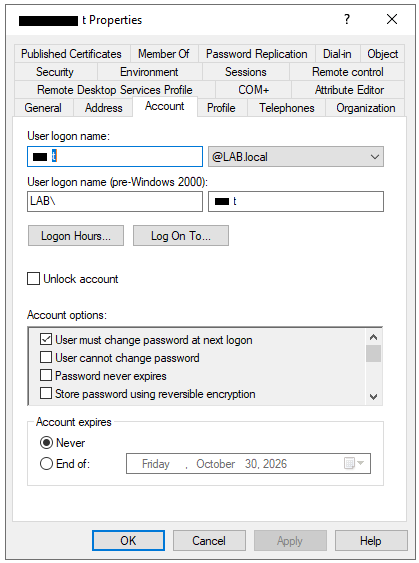

## Password Reset

### Task
Practice the Active Directory password reset procedure for a user account.

### Why
Password reset requests are a common Help Desk task. Administrators can reset a user's password and require the user to create a new password at their next login.

### What I did
Opened the user's account in Active Directory Users and Computers and accessed the **Reset Password** function. I reviewed the password reset options and enabled **User must change password at next logon**.

### Verification
Verified that the Reset Password window provides fields for entering and confirming a new password and includes the option to require a password change at the next logon.

### Evidence
`09-password-reset.png` - Active Directory Reset Password window showing the password reset options.
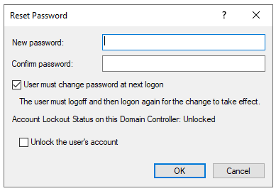

## Disabled User Account

### Task
Practice identifying and managing a disabled Active Directory user account.

### Why
User accounts may be disabled when access needs to be temporarily or permanently removed. Help Desk staff may need to identify the account status and, when authorized, re-enable the account.

### What I did
Located the user account in the HR Organizational Unit in Active Directory Users and Computers. Right-clicked the disabled account to access the account management options.

### Verification
The account is displayed with the disabled account indicator, and the context menu provides the **Enable Account** option.

### Evidence
`10-disabled-user-account.png` - Active Directory Users and Computers showing a disabled user account and the **Enable Account** option.
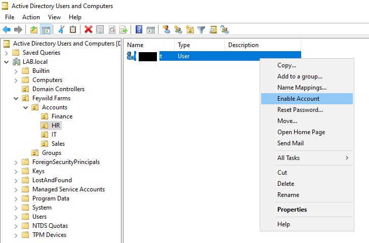

## Security Group Membership

### Task
Verify user membership in a department-specific Active Directory security group.

### Why
Security group membership can be used to assign access to shared resources and permissions based on a user's department or role.

### What I did
Opened the Finance security group's properties in Active Directory Users and Computers and reviewed the **Members** tab.

### Verification
Verified that the user account is listed as a member of the Finance security group.

### Evidence
`11-finance-group-membership.png` - Active Directory security group properties showing a user account listed as a group member.
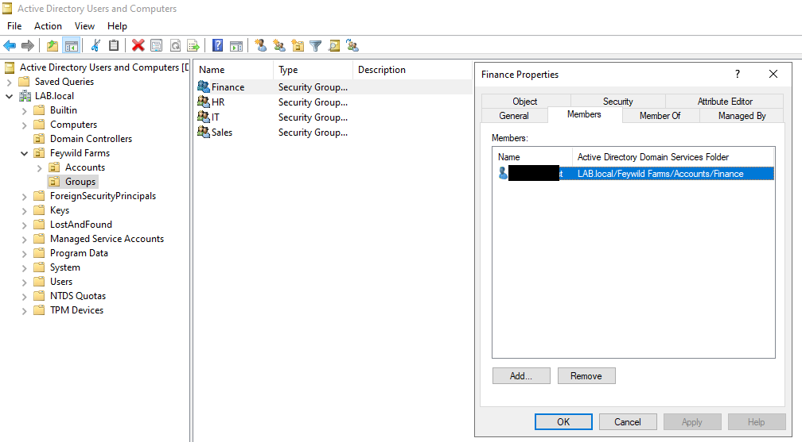

## Security Group Configuration

### Task
Configure and verify the type and scope of an Active Directory security group.

### Why
Security group type and scope determine how a group can be used to manage access and permissions within an Active Directory environment.

### What I did
Opened the Finance security group's properties in Active Directory Users and Computers and reviewed the **General** tab.

### Verification
Verified that the Finance group is configured as a **Security** group with a **Global** group scope.

### Evidence
`12-finance-security-group.png` - Finance security group properties showing Global scope and Security group type.
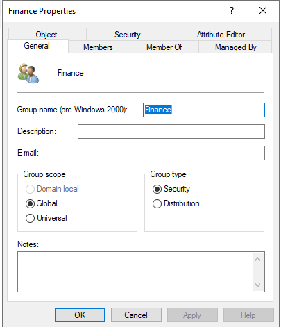

## NTFS Folder Permissions

### Task
Configure NTFS permissions on a shared folder using an Active Directory security group.

### Why
NTFS permissions control which users and groups can access files and folders and what actions they are allowed to perform.

### What I did
Created the `HR-Share` folder on the Domain Controller and added the `LAB\HR` security group to the folder's Security permissions. Granted the HR group **Modify** permissions.

### Verification
Verified that `LAB\HR` is listed in the folder's Security settings with **Modify** permission.

### Evidence
`13-hr-folder-permissions.png` - HR-Share folder Security settings showing the HR security group with Modify permission.
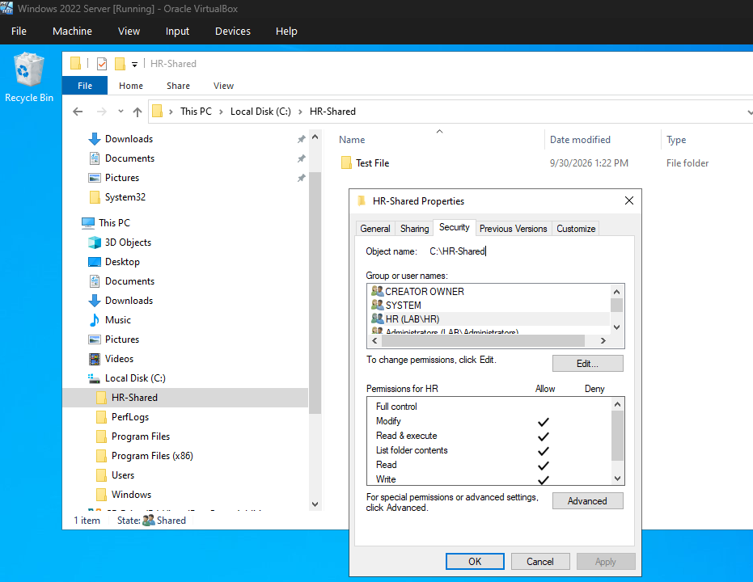

## Client Access to Shared Folder

### Task
Verify that an authorized domain user can access the HR shared folder from a Windows client.

### Why
Shared folders allow users to access files and resources hosted on another computer over the network. Access should be limited according to the permissions assigned to the appropriate security group.

### What I did
From the Windows 11 client, navigated through the network to `DC01` and opened the `HR-Share` folder.

### Verification
Verified that the HR-Share folder was accessible from the client and that the existing test file was visible.

### Evidence
`14-client-access-hr-share.png` - Windows 11 client accessing the HR-Share folder hosted on DC01.
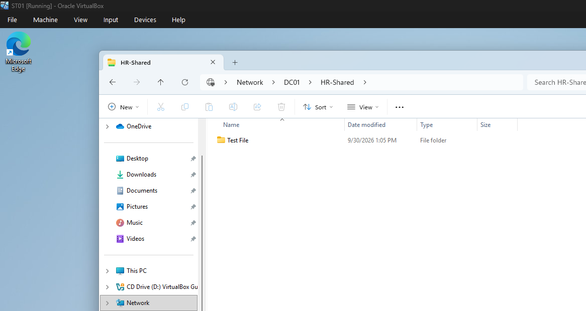

## Shared Folder Write Access

### Task
Verify that an authorized user can create files in the HR shared folder.

### Why
Access permissions should allow authorized users to perform the actions required for their role while restricting unauthorized access.

### What I did
From the Windows 11 client, accessed the `HR-Share` folder on `DC01` and created the `HR-Test.txt` file.

### Verification
Verified that the `HR-Test.txt` file was successfully created in the shared folder, demonstrating that the HR user has write access.

### Evidence
`15-hr-share-write-access-restricted.png` - Windows 11 client showing the `HR-Test.txt` file created in the HR-Share folder.
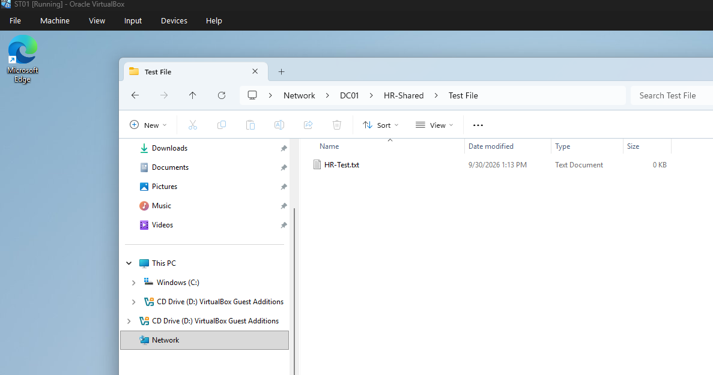

## Restricted Share Permissions

### Task
Configure share permissions so that access to the HR shared folder is limited to the HR security group.

### Why
Share permissions determine which users and groups can access a folder through the network. Restricting access to the appropriate security group helps prevent unauthorized users from accessing departmental resources.

### What I did
Opened the Advanced Sharing permissions for `HR-Share`, removed the `Everyone` group, and added the `LAB\HR` security group with **Read** and **Change** permissions.

### Verification
Verified that `LAB\HR` is the only listed group with share permissions and that both **Read** and **Change** are allowed.

### Evidence
`16-hr-share-permissions.png` - HR-Share Advanced Sharing permissions showing access restricted to the HR security group.
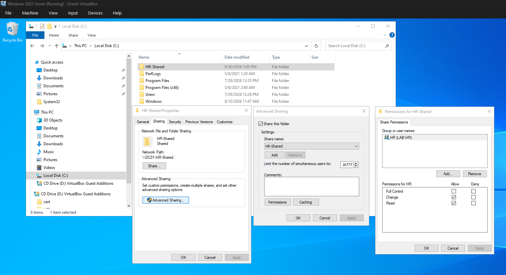

## Troubleshooting

### DNS Resolution Testing

During testing, `nslookup` reported DNS request timeouts when querying the `LAB.local` domain.

I troubleshot the issue using an OSI layered approach:

- Verified ST01 IPv4 configuration and connectivity to DC01.
- Confirmed TCP port 53 was reachable.
- Confirmed DC01 was listening for DNS traffic on port 53.
- Verified Windows Firewall rules allowed DNS traffic.
- Confirmed `LAB.local` resolved successfully using `Resolve-DnsName`.
- Investigated `nslookup` and found it was using the IPv6 loopback address (`::1`) as its default DNS server.
- Tested `nslookup` using the IPv4 loopback address (`127.0.0.1`), which returned the expected result without the same timeout behavior.

**Conclusion:** The AD DNS service and network connectivity were functioning. The timeout behavior was isolated to `nslookup` when using the IPv6 loopback address in this IPv4-focused lab environment.

